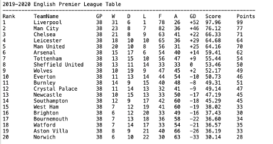

# EPL_Ranking_System

This is the final project of INFO6205 Data Structure and Algorithm class.

## Project Description

This project is aim to predict 2019/20 EPL final result. We use Poisson distribution to simulate the possible outcome of one match. To make this prediction more accurate, we also consider the home team advantage.

The ranking system will generate the score for each match and give out the final rank table.

## Project Structure

- **Data**

 The data we used in this ranking system is in ```./src/datasets``` 
 which is referenced from http://www.football-data.co.uk/englandm.php

- **Prediction**

The prediction process is in ```./src/SimulateEPL```

- **Output**

The output of the ranking system is in ```./src/Result```

## Getting Started

- **Installing**

software: 
running environment: java8

- **Clone**

run in the Terminal:
```git clone https://github.com/YYYifan/EPL_Ranking_System.git```

- **Run the application**

run the Main.java file from src folder

- **Rank table**(./src/Result/EPL_RankingTable.csv)



## Author

| Name        | NUID      |
| ----------- | --------- |
| Yifan Zhang | 001837603 |
| Leming Li   | 001054503 |


